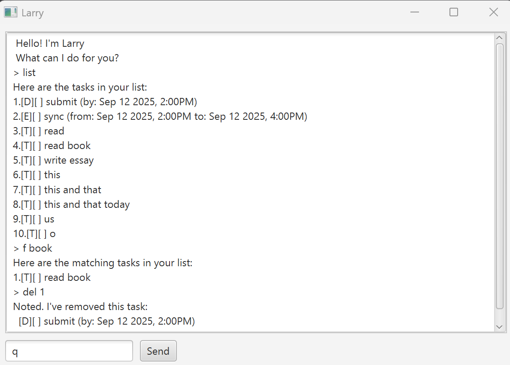

# Larry

> “Your mind is for having ideas, not holding them.” — David Allen

**Larry** is a simple, text-based task bot with a small JavaFX GUI. It lets you track **todos**, **deadlines**, and **events**, and saves them to disk so your list survives restarts.

- Java 17
- Gradle build
- CLI **and** GUI
- Saves to `data/larry.txt`

---

## Screenshot



---

## Quick start

### GUI (recommended)
```bash
# from the repo root
./gradlew run         # Windows: .\gradlew run
